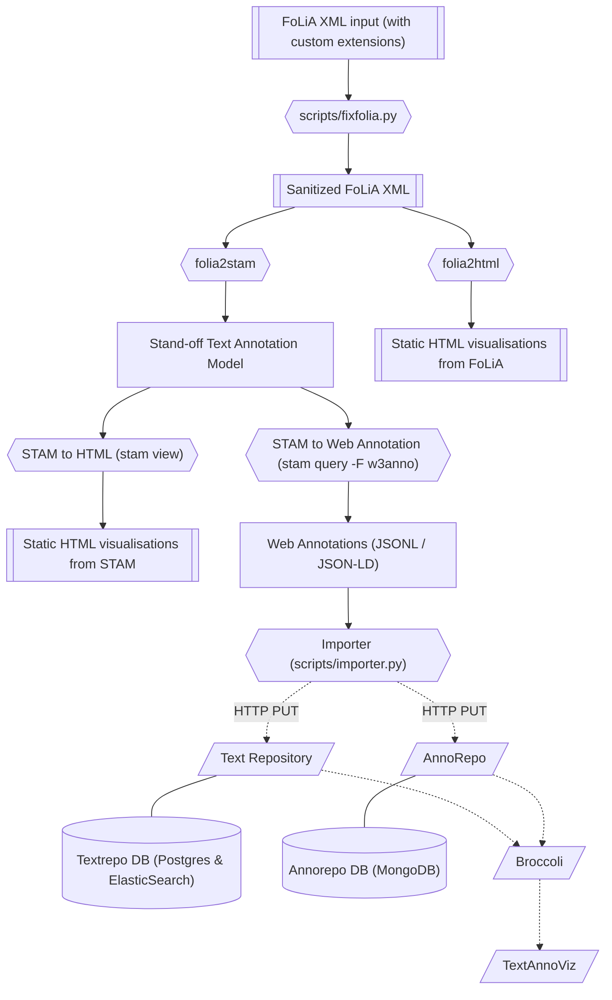

# Brieven van Hooft pipeline

## Introduction

The aim of this project is to make the *Brieven van [P.C.
Hooft](https://nl.wikipedia.org/wiki/Pieter_Corneliszoon_Hooft)* better 
accessible to researchers. 

These have been linguistically enriched with part-of-speech tags and lemmas in an earlier project and
delivered in [FoLiA XML](https://proycon.github.io/folia) format. We intend to
produce W3C Web Annotations via [STAM](https://annotation.github.io), so the
texts and any annotations can ultimately be showed and queried via
[TextAnnoViz](https://github.com/knaw-huc/textannoviz), a web-application that
builds upon other infrastructure
([TextRepo](https://github.com/knaw-huc/textrepo),
[AnnoRepo](https://github.com/knaw-huc/annorepo),
[Broccoli](https://github.com/knaw-huc/broccoli)) at KNAW HuC's Team Text.

This project serves a test-case to use STAM as a pivot model for untangling
FoLiA and making it available as W3C Web Annotations.

## Data Exploration

* The data consists of 333 FoLiA XML documents (75MB)
* Each FoLiA document corresponds to a letter. The number in the filename does *NOT* correspond to the number of the letter.
* The FoLiA XML has been annotated with some custom XML elements (which renders the FoLiA invalid so a correction needs to be applied before we can process it with regular FoLiA tools), fortunately the custom elements are well-documented.
* The data carries two independent sets of part-of-speech and lemma annotations. One automated as outputted by [Frog](https://languagemachines.github.io/frog), and set of one manual annotations. The automated seems to have been done with the default Frog models which are trained on contemporary Dutch, so the accuracy will not be very good. The manual annotations are more interesting, and seem to use a custom tagset loosely derived from CGN, for part-of-speech tagging.
* The data comes from three upstream sources (three books *"De briefwisseling van Pieter Corneliszoon Hooft*, edited by H.W van Tricht e.a., that together form a collection), plain text, TEI and PDF versions are published for all four:
    * <https://www.dbnl.org/tekst/hoof001hwva02_01/>
    * <https://www.dbnl.org/tekst/hoof001hwva03_01/>
    * <https://www.dbnl.org/tekst/hoof001hwva04_01/>
* License information for the works: <https://www.dbnl.org/titels/gebruiksvoorwaarden.php?id=hoof001hwva03>
* The lines (corresponding with the originals in the scan I presume) in the plaintext, PDF and TEI, are numbered .
* The TEI does not contain hard/persistent identifiers
* Some data that is present in the original version is no longer present in the FoLiA, it was probably stripped in some preprocesing:
    * Line information is not present in the FoLiA versions.
    * Page numbers are not present in the FoLiA version
    * The original version contains footnotes (and references to them).
* Lines may be tied together using hyphenation, no dehyphenation was performed prior to processing by Frog so this leads to incorrect tokens, sentence boundaries, paragraph boundaries and incorrect PoS/lemma tags. The authors have tried to remedy this in their manual annotation stage using custom alignment tags.
* There is no data that ties the text documents to the original scans.

### Questions

*Q: What form of the data do we consider the source of the data that we want to make references to?*

[proycon] Though the original source is of course the physical letters (and
derived from that are the scans), we don't have that data, nor an alignment to
it. The work as published by H.W. van Tricht, and as digitized in the DBNL,
should I think be considered the source. Derived from that is the
linguistically enriched FoLiA version, for which an explicit alignment with the
DBNL version is not available. If the DBNL plain text version is persistent
enough it might be worth considering that as the source and attempting to
realign the annotations in the FoLiA with that, but this will take significant
extra effort.

*Q: I assume we are mainly interested in the manual annotations?*

## Use case

*(Describe the wishes and requirements from the researcher's perspective)*

## Requirements

* **Software:** `folia2stam` - FoLiA XML to STAM converter, already largely implemented in [folia-tools](https://github.com/proycon/folia-tools).
* **Software:** [STAM-tools](https://github.com/annotation/stam-tools) - Tooling for dealing with STAM
* **Software:** [TextRepo](https://github.com/knaw-huc/textrepo) - Backend repository to store and index corpora with metadata and versions
* **Software:** [AnnoRepo](https://github.com/knaw-huc/annorepo) - A webservice for W3C Web Annotations, implementing the W3C Web Annotation Protocol.
* **Software:** [Broccoli](https://github.com/knaw-huc/broccoli) - Intermediary between various backend storage engines (currently: textrepo, annorepo) and frontend TextAnnoViz.
* **Software:** [TextAnnoViz](https://github.com/knaw-huc/textannoviz) - Frontend to view texts, scans, and annotations.

Some of the above may need some extension and tweaking in the scope of this project.

## Deliverables

* **Software:** A conversion pipeline to take the current form of Brieven van Hooft and transform it in such a way that it can be shown in TextAnnoViz. This git repository will primarily hold this implementation, its input and output.
    * The pipeline includes some preprocessors to fix the FoLiA input, as the data authors added some extensions that renders the FoLiA invalid. (*Time estimate:* 8 hours)
    * **Software:** `stam2webanno` - STAM to W3C Web Annotation export. This STAM extension is already [formulated here](https://github.com/annotation/stam/tree/master/extensions/stam-webannotations) but is not implemented yet.
        * *Time estimate:* 40 hours
* **Service:** TextAnnoViz service for Brieven van Hooft, allowing to interactively search and view the letters and annotations online.
* **Data:** STAM model for Brieven van Hooft. This can be queried and visualised using low-level local tools.
* **Data (optional):** Some static HTML visualisations provided via the STAM tooling, not reliant on any further infrastructure.
* **Data (optional):** Some static HTML visualisations provided via the FoLiA tooling, not reliant on any further infrastructure.

## Pipeline Architecture

