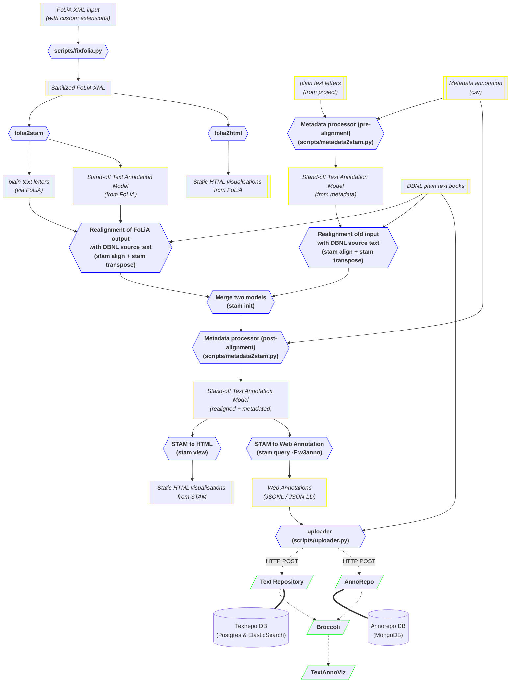

# Brieven van Hooft pipeline

## Introduction

The aim of this project is to make the *Brieven van [P.C.
Hooft](https://nl.wikipedia.org/wiki/Pieter_Corneliszoon_Hooft)* better 
accessible to researchers. 

These have been linguistically enriched with part-of-speech tags and lemmas in an earlier project and
delivered in [FoLiA XML](https://proycon.github.io/folia) format. We intend to
produce W3C Web Annotations via [STAM](https://annotation.github.io), so the
texts and any annotations can ultimately be showed and queried via
[TextAnnoViz](https://github.com/knaw-huc/textannoviz), a web-application that
builds upon other infrastructure
([TextRepo](https://github.com/knaw-huc/textrepo),
[AnnoRepo](https://github.com/knaw-huc/annorepo),
[Broccoli](https://github.com/knaw-huc/broccoli)) at KNAW HuC's Team Text.

This project serves a test-case to use STAM as a pivot model for untangling
FoLiA and making it available as W3C Web Annotations. End-users are recommended
to check out [Brieven van Hooft -
Notebook](https://github.com/knaw-huc/brieven-van-hooft-notebook) rather than
this repository, the notebook is a derived project allows to interactively
visualise and explore the corpus that was built with this pipeline.

## Data Exploration

* The data consists of 333 FoLiA XML documents (75MB)
* Each FoLiA document corresponds to a letter. The number in the filename does *NOT* correspond to the number of the letter.
* The FoLiA XML has been annotated with some custom XML elements (which renders the FoLiA invalid so a correction needs to be applied before we can process it with regular FoLiA tools), fortunately the custom elements are well-documented.
* The data carries two independent sets of part-of-speech and lemma annotations. One automated as outputted by [Frog](https://languagemachines.github.io/frog), and set of one annotations that was done semi-automatically via Adelheid and manual post-correction in a tool called Gustave.. The Frog enrichment has been done with the Frog models which are trained on contemporary Dutch, so the accuracy will not be very good. The manual annotations are more interesting, and seem to use a custom tagset loosely derived from CGN, for part-of-speech tagging.
* The data comes from three upstream sources (three books *"De briefwisseling van Pieter Corneliszoon Hooft*, edited by H.W van Tricht e.a., that together form a collection), plain text, TEI and PDF versions are published for all four:
    * <https://www.dbnl.org/tekst/hoof001hwva02_01/>
    * <https://www.dbnl.org/tekst/hoof001hwva03_01/>
    * <https://www.dbnl.org/tekst/hoof001hwva04_01/>
* License information for the works: <https://www.dbnl.org/titels/gebruiksvoorwaarden.php?id=hoof001hwva03>
* The lines (corresponding with the originals in the scan I presume) in the plaintext, PDF and TEI, are numbered .
* The TEI does not contain hard/persistent identifiers
* Some data that is present in the original version is no longer present in the FoLiA, it was probably stripped in some preprocesing:
    * Line information is not present in the FoLiA versions.
    * Page numbers are not present in the FoLiA version
    * The original version contains footnotes (and references to them).
* Lines may be tied together using hyphenation, no dehyphenation was performed prior to processing by Frog so this leads to incorrect tokens, sentence boundaries, paragraph boundaries and incorrect PoS/lemma tags. The authors have tried to remedy this in their manual annotation stage using custom alignment tags.
* There is no data that ties the text documents to the original scans.
* There are various metadata annotations that have been made outside of the FoLiA. For some, it is not yet clear what text they reference and if they can be recovered exactly!

All input data from the 2017 project is published in a separate git repository,
which is only **privately accessible** due to license constraints (DBNL only
allowed us to republish the original 17th century text). This repository can be
found at <https://gitlab.huc.knaw.nl/tt/brieven-van-hooft-data> and is included
as a git submodule in `data/input`. Contact [Hennie
Brugman](mailto:hennie.brugman@di.huc.knaw.nl) for access.

### Questions

*Q: What form of the data do we consider the source of the data that we want to make references to?*

[proycon] Though the original source is of course the physical letters (and
derived from that are the scans), we don't have that data, nor an alignment to
it. The work as published by H.W. van Tricht, and as digitized in the DBNL,
should I think be considered the source. Derived from that is the
linguistically enriched FoLiA version, for which an explicit alignment with the
DBNL version is not available. If the DBNL plain text version is persistent
enough it might be worth considering that as the source and attempting to
realign the annotations in the FoLiA with that, but this will take significant
extra effort.

*Q: I assume we are mainly interested in the manual annotations?*

Yes, but the automatic ones will also be preserved as the comparison might be
interesting. In a later project, retraining might also be interesting.

*Q: License for the FoLiA data?*

The annotations are open, as for the text from DBNL, only the original 17th century texts may be republished. This excludes the editorial footnotes made later.

## Use case

Researchers want to be able to search and visualise the letters:
    * based on patterns in the linguistic annotation (e.g. discovering double annotations), e.g. via CQL
    * search on metadata (e.g correspondents, time period)
    * they want to be able to search only in the text by van Hooft (not the editorial notes)
    
## Allocated time

120 ~ 200 hours

## Requirements

* **Software:** `folia2stam` - FoLiA XML to STAM converter, already largely implemented in [folia-tools](https://github.com/proycon/folia-tools).
* **Software:** [STAM-tools](https://github.com/annotation/stam-tools) - Tooling for dealing with STAM
* **Software:** [TextRepo](https://github.com/knaw-huc/textrepo) - Backend repository to store and index corpora with metadata and versions
* **Software:** [AnnoRepo](https://github.com/knaw-huc/annorepo) - A webservice for W3C Web Annotations, implementing the W3C Web Annotation Protocol.
* **Software:** [Broccoli](https://github.com/knaw-huc/broccoli) - Intermediary between various backend storage engines (currently: textrepo, annorepo) and frontend TextAnnoViz.
* **Software:** [TextAnnoViz](https://github.com/knaw-huc/textannoviz) - Frontend to view texts, scans, and annotations.

Some of the above may need some extension and tweaking in the scope of this project.

## Deliverables

* **Software:** A conversion pipeline to take the current form of Brieven van Hooft and transform it in such a way that it can be shown in TextAnnoViz. This git repository will primarily hold this implementation, its input and output.
    * The pipeline includes some preprocessors to fix the FoLiA input, as the data authors added some extensions that renders the FoLiA invalid. (*Time estimate:* 8 hours)
    * The pipeline includes processors to ingest the sociolinguistic metadata that is not in the FoLiA (*Time estimate:* 8 hours)
    * **Software:** STAM to W3C Web Annotation export. This STAM extension is already [formulated here](https://github.com/annotation/stam/tree/master/extensions/stam-webannotations). It has been largely implemented already in preparation for this project.
        * *Time estimate:* 40 hours
    * **Software:** `stam align` - Realign annotations against a new text resource. Needed to re-align the annotations from the FoLiA with the original text source.
        * *Time estimate:* 20 hours
* **Service:** TextAnnoViz service for Brieven van Hooft, allowing to interactively search and view the letters and annotations online.
* **Data:** STAM model for Brieven van Hooft. This can be queried and visualised using low-level local tools.
* **Data (optional):** Some static HTML visualisations provided via the STAM tooling, not reliant on any further infrastructure.
* **Data (optional):** Some static HTML visualisations provided via the FoLiA tooling, not reliant on any further infrastructure.

## Pipeline Architecture



## Output vocabulary

### Web Annotations

The web annotations that are uploaded to AnnoRepo look like:

```json
{
  "@context": [
    "http://www.w3.org/ns/anno.jsonld",
    {
      "folia": "https://w3id.org/folia/v2/",
      "pos": "urn:brievenvanhooft:dataset/gustave-pos/"
    }
  ],
  "id": "urn:brievenvanhooft:annotation/rp4yZApQ2lHuYX98YJT3y-transposed",
  "type": "Annotation",
  "generated": "2024-03-28T10:29:53.093124794+01:00",
  "generator": {
    "id": "https://github.com/annotation/stam-rust",
    "type": "Software",
    "name": "STAM Library"
  },
  "body": {
    "type": "Dataset",
    "id": "3396719bc05f7325cc3e8e7b87f2dcc5",
    "folia:elementtype": "pos",
    "folia:annotationtype": "pos",
    "pos:class": "TW(hoofd)",
    "folia:confidence": 0,
    "pos:head": "TW",
    "pos:numtype": "hoofd"
  },
  "target": [
    {
      "source": "https://www.dbnl.org/nieuws/text.php?id=hoof001hwva02",
      "selector": {
        "type": "TextPositionSelector",
        "start": 178357,
        "end": 178358
      },
      "state": {
        "type": "TimeState",
        "sourceDate": "2024-03-19T13:42:24.314842"
      }
    },
    {
      "source": "https://brieven-van-hooft.tt.di.huc.knaw.nl/textrepo/rest/versions/711a1782-fdb4-4cbb-b130-01d1c0b76d1e",
      "selector": {
        "@context": "https://knaw-huc.github.io/ns/huc-di-tt.jsonld",
        "type": "TextAnchorSelector",
        "start": 1784,
        "end": 1784
      },
      "type": "Text"
    },
    {
      "source": "https://brieven-van-hooft.tt.di.huc.knaw.nl/textrepo/view/versions/711a1782-fdb4-4cbb-b130-01d1c0b76d1e/segments/index/1784/1784",
      "type": "Text"
    }
  ]
}
```

The context defines the following prefixes:

* ``folia: https://w3id.org/folia/v2/`` - Contains vocabulary predefined by FoLiA, such as linguistic annotation types, structural annotation types, and others. The ontology is defined here: <https://github.com/proycon/folia/blob/master/schemas/folia.ttl> .
Not all FoLiA annotations have been propagated to the Web Annotation output, to keep things more manageable.
* ``pos: urn:brievenvanhooft:dataset/gustave-pos/`` - Part-of-Speech tags as annotated (semi-automatically with curation) in the 2017 project.
    * The full part-of-speech tag can always be found in the `pos:class` property.
* ``lem: urn:brievenvanhooft:dataset/gustave-lem/`` - Lemma as annotated (semi-automatically with curation) in the 2017 project.
    * The lemma can be found in the `lem:class` property.


High-level metadata (the sociolinguistic annotations that were kept in CSV
files) is grouped into one annotation as much as possible, this is the tier1
level:

```json
{
  "@context": "http://www.w3.org/ns/anno.jsonld",
  "id": "urn:brievenvanhooft:annotation/hoof001hwva03_01_0255",
  "type": "Annotation",
  "generated": "2024-03-28T10:33:43.346706921+01:00",
  "generator": {
    "id": "https://github.com/annotation/stam-rust",
    "type": "Software",
    "name": "STAM Library"
  },
  "body": {
    "id": "d7127675953d73de3c81f1aea13d1583",
    "type": "Letter",
    "urn:brievenvanhooft:metadata/brieven-van-hooft-metadata/dbnl_id": "hoof001hwva03_01_0255",
    "urn:brievenvanhooft:metadata/brieven-van-hooft-categories/type": "private",
    "urn:brievenvanhooft:metadata/brieven-van-hooft-categories/dependency": "independent",
    "urn:brievenvanhooft:metadata/brieven-van-hooft-categories/function": "raad",
    "urn:brievenvanhooft:metadata/brieven-van-hooft-categories/topic": "overlijden",
    "urn:brievenvanhooft:metadata/brieven-van-hooft-metadata/letter_id": "621",
    "urn:brievenvanhooft:metadata/brieven-van-hooft-metadata/dated": "21-4-1634",
    "urn:brievenvanhooft:metadata/brieven-van-hooft-metadata/correspondent_id": "114",
    "urn:brievenvanhooft:metadata/brieven-van-hooft-metadata/recipient": "Baek",
    "urn:brievenvanhooft:metadata/brieven-van-hooft-metadata/function": "Zwager van Hooft",
    "urn:brievenvanhooft:metadata/brieven-van-hooft-metadata/invidividual": 1,
    "urn:brievenvanhooft:metadata/brieven-van-hooft-metadata/literary": 0,
    "urn:brievenvanhooft:metadata/brieven-van-hooft-metadata/gender": "male",
    "urn:brievenvanhooft:metadata/brieven-van-hooft-metadata/birthyear": 1596,
    "urn:brievenvanhooft:metadata/brieven-van-hooft-metadata/deathyear": 1681,
    "urn:brievenvanhooft:metadata/brieven-van-hooft-metadata/birthyear_unclear": 1,
    "urn:brievenvanhooft:metadata/brieven-van-hooft-metadata/deathyear_unclear": 1
  },
  "target": [
    {
      "source": "https://www.dbnl.org/nieuws/text.php?id=hoof001hwva03",
      "selector": {
        "type": "TextPositionSelector",
        "start": 971927,
        "end": 973042
      },
      "state": {
        "type": "TimeState",
        "sourceDate": "2024-03-19T13:42:24.314842"
      }
    },
    {
      "source": "https://brieven-van-hooft.tt.di.huc.knaw.nl/textrepo/rest/versions/4bcb047f-a28b-42d3-a91f-04e3716ce236",
      "selector": {
        "@context": "https://knaw-huc.github.io/ns/huc-di-tt.jsonld",
        "type": "TextAnchorSelector",
        "start": 84692,
        "end": 85068
      },
      "type": "Text"
    },
    {
      "source": "https://brieven-van-hooft.tt.di.huc.knaw.nl/textrepo/view/versions/4bcb047f-a28b-42d3-a91f-04e3716ce236/segments/index/84692/85068",
      "type": "Text"
    }
  ]
}
```

The metadata, originally from CSV files and documented [here](https://github.com/knaw-huc/brieven-van-hooft-pipeline/blob/main/data/metadata/README), is:

* `urn:brievenvanhooft:metadata/brieven-van-hooft-categories/type`: `private` or `business` , for private/personal correspondence vs business correspondence
* `urn:brievenvanhooft:metadata/brieven-van-hooft-categories/dependency`: `accompanying` or `independent`, 
* `urn:brievenvanhooft:metadata/brieven-van-hooft-categories/dbnl_id`: ID as known at DBNL
* `urn:brievenvanhooft:metadata/brieven-van-hooft-categories/letter_id`: Letter sequential ID (not always strictly numeric)
* For the remainder of the metadata properties, see [here](https://github.com/knaw-huc/brieven-van-hooft-pipeline/blob/main/data/metadata/README). Note that not all properties are always present!

This is the tier0 level:

```json
{
  "@context": "http://www.w3.org/ns/anno.jsonld",
  "id": "urn:brievenvanhooft:annotation/hoof001hwva02",
  "type": "Annotation",
  "generated": "2024-03-28T10:33:43.265217633+01:00",
  "generator": {
    "id": "https://github.com/annotation/stam-rust",
    "type": "Software",
    "name": "STAM Library"
  },
  "body": {
    "id": "7404ee9df3ec93b396baf5c83f457c29",
    "type": "File",
    "urn:brievenvanhooft:metadata/brieven-van-hooft-metadata/dbnl_id": "hoof001hwva02",
    "urn:brievenvanhooft:metadata/brieven-van-hooft-metadata/volume": "1"
  },
  "target": [
    {
      "source": "https://www.dbnl.org/nieuws/text.php?id=hoof001hwva02",
      "selector": {
        "type": "TextPositionSelector",
        "start": 0,
        "end": 1873371
      },
      "state": {
        "type": "TimeState",
        "sourceDate": "2024-03-19T13:42:24.314842"
      }
    },
    {
      "source": "https://brieven-van-hooft.tt.di.huc.knaw.nl/textrepo/rest/versions/711a1782-fdb4-4cbb-b130-01d1c0b76d1e",
      "selector": {
        "@context": "https://knaw-huc.github.io/ns/huc-di-tt.jsonld",
        "type": "TextAnchorSelector",
        "start": 0,
        "end": 135375
      },
      "type": "Text"
    },
    {
      "source": "https://brieven-van-hooft.tt.di.huc.knaw.nl/textrepo/view/versions/711a1782-fdb4-4cbb-b130-01d1c0b76d1e/segments/index/0/135375",
      "type": "Text"
    }
  ]
}
```
